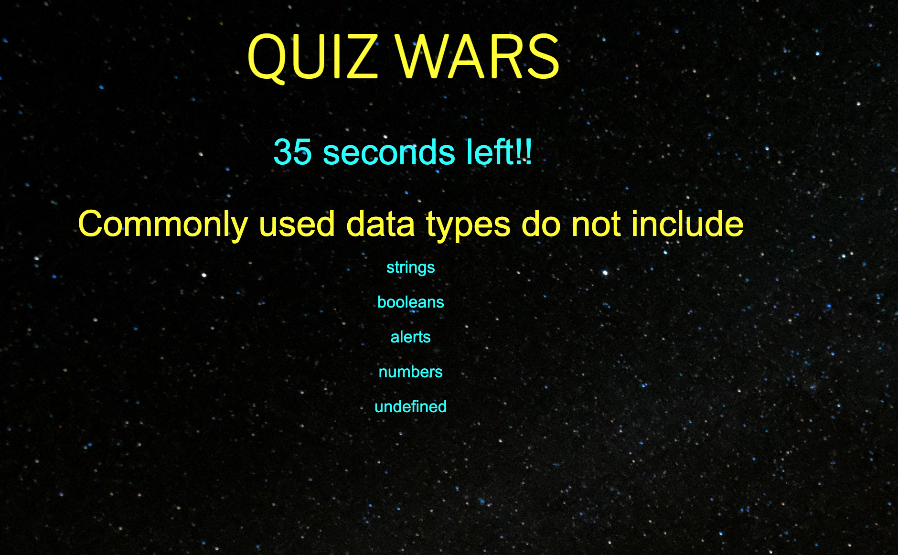

# 04 Web APIs: Code Quiz

## Description
This is a Quiz Game.  Click here to try it out!
https://bcebel.github.io/WebAPICodeQuiz/

It is a quiz game with a count down.  

The game starts by pressing start!  Then a countdown will start, if you get an incorrect answer 5 seconds are removed from your time.  Upon completion of the quiz you are prompted to enter your initials to recieve your score.  A leader board appears with the previous top 3 scores, if you make the top three you will be on the list for the next round.  

Challenges were navigating objects and DOM manipulation!  HOWEVER!  Now that I see the relationship between objects and methods and the galaxy of JavaScript I can see the possibilities are endless!

## License 
MIT License, see repository for details. 

